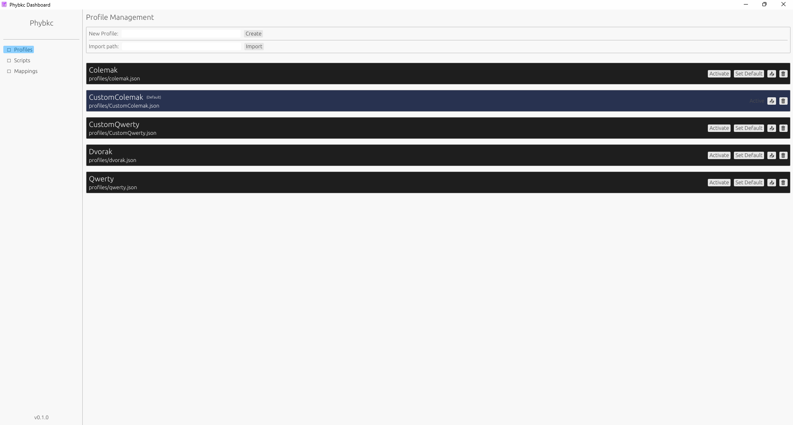
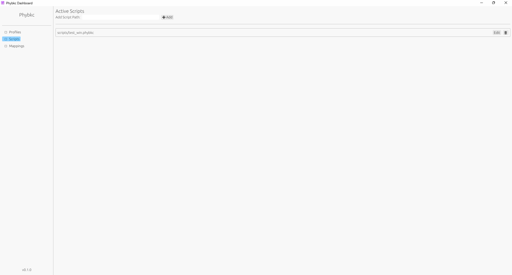
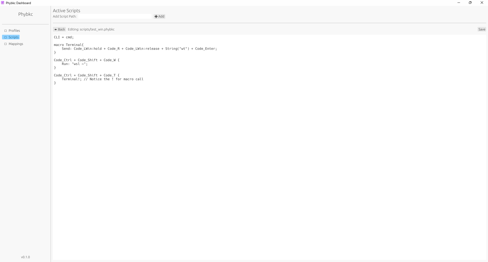
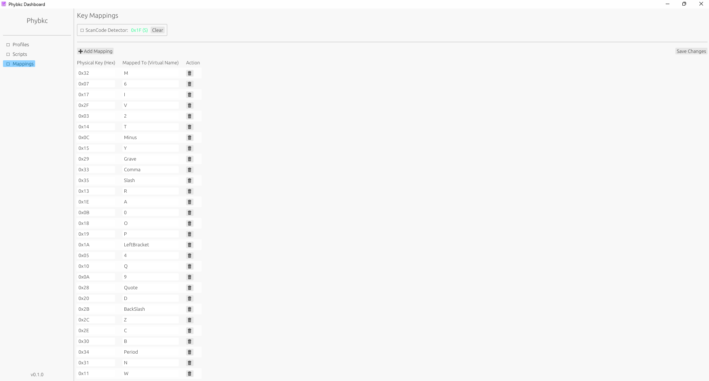

## 使い方

### ダウンロード方法

1. [https://github.com/kazanefu/phybkc/releases](https://github.com/kazanefu/phybkc/releases)にある**release.zip**をダウンロードし、適当な場所に展開する。
2. `gui.exe`, `daemon.exe`と`profiles`フォルダがあることを確認してください。

### GUI

`gui.exe`を起動(多分警告が出ると思いますが詳細情報を押して実行を押すことで起動できます。また、ショートカットを用意しておくと便利です)

開くとプロファイル一覧が表示されている画面になっていると思います。


**New Profile**にプロファイル名を入力し、`Create`を押すことで新たなプロファイルを作ることができます。また、**Import path**にプロファイルのjsonファイルのフルパスを入力して`Import`を押すことでjsonファイルからインポートすることができます。jsonファイルの形式は以下の通りです。`"keys"`はScanCodeです。
```json
{
    "name": "Qwerty",
    "keyboard": "Default",
    "scripts": [],
    "keys": {
        "0x02": "1",
        "0x03": "2",
        "0x04": "3",
        "0x05": "4",
        "0x06": "5",
        "0x07": "6",
        "0x08": "7",
        "0x09": "8",
        "0x0A": "9",
        "0x0B": "0",
        "0x0C": "Minus",
        "0x0D": "Equal",
        "0x10": "Q",
        "0x11": "W",
        "0x12": "E",
        "0x13": "R",
        "0x14": "T",
        "0x15": "Y",
        "0x16": "U",
        "0x17": "I",
        "0x18": "O",
        "0x19": "P",
        "0x1A": "LeftBracket",
        "0x1B": "RightBracket",
        "0x1E": "A",
        "0x1F": "S",
        "0x20": "D",
        "0x21": "F",
        "0x22": "G",
        "0x23": "H",
        "0x24": "J",
        "0x25": "K",
        "0x26": "L",
        "0x27": "SemiColon",
        "0x28": "Quote",
        "0x29": "Grave",
        "0x2B": "BackSlash",
        "0x2C": "Z",
        "0x2D": "X",
        "0x2E": "C",
        "0x2F": "V",
        "0x30": "B",
        "0x31": "N",
        "0x32": "M",
        "0x33": "Comma",
        "0x34": "Period",
        "0x35": "Slash"
    }
}
```

`Activate`で編集するプロファイルを選択し`Set Default`で起動時のプロファイルを選択できます。

**Scripts**を開くと以下のような画面になります。`Add Script Path`にスクリプトのパスを入力して`add`を押すことでプロファイルにスクリプトを追加することができます。スクリプトの拡張子は`.phybkc`のテキストファイルにしてください。

また、編集は`Edit`を押すことでできますが、普通に普段お使いのテキストエディタを使うことをお勧めします。



**Mappings**ではキーマッピングをできます。左上の`ScanCode Detector`に押したキーのScanCodeが表示されます。また、`Add Mapping`でマッピングを追加できます左側にScanCodeを、右側に割り当てたいものを書いてください。また、変更の保存は忘れないようにご注意ください。


